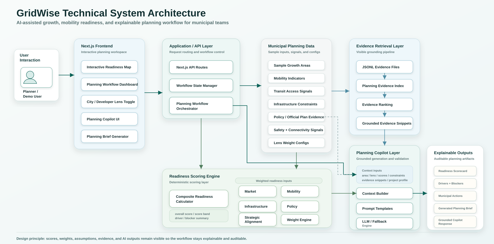

# GridWise

GridWise is an independent portfolio prototype for AI-assisted municipal planning. It helps planners evaluate growth and mobility readiness across sample urban areas, identify transportation and infrastructure constraints, and generate explainable next actions that would otherwise require repetitive manual planning review.

The product is framed around a city-government workflow: select an area, understand why it ranks the way it does, inspect mobility and infrastructure blockers, compare City and Developer priorities, and generate a short planning brief grounded in visible evidence.

GridWise uses sample planning data and is not an official municipal planning tool.

## Product Framing

GridWise is designed for the kind of customer-facing GovTech workflow used by transportation and urban planning teams:

- Automate repetitive review of growth, mobility, infrastructure, policy, and feasibility signals.
- Help municipal planners prioritize where public action could unlock readiness.
- Explain recommendations with visible scores, weights, assumptions, evidence snippets, and constraints.
- Support fast iteration during planning conversations and early-stage analysis.

Instead of acting like a generic analytics dashboard, GridWise behaves like a planning workflow assistant: it turns scattered planning factors into a concise, auditable recommendation.

## Core Workflow

1. Choose a sample growth area from the list or map.
2. Review its overall growth and mobility readiness score.
3. Inspect the strongest drivers and biggest blockers.
4. Compare Market, Mobility, Infrastructure, Policy, and Strategic readiness.
5. Switch between the City lens and Developer lens.
6. Open the Planning Copilot to ask planning questions or generate a brief.
7. Use recommended municipal actions to identify the next planning step.

## Key Features

### Growth + Mobility Readiness Map

The map displays sample urban areas using Leaflet and OpenStreetMap tiles. Areas are colored by overall readiness:

- **High readiness:** 75 or higher
- **Moderate readiness:** 50 to 74
- **Low readiness:** below 50

Clicking an area updates the entire workflow: score, evidence, constraints, mobility considerations, recommendations, and Planning Copilot context.

### First-Class Mobility Readiness

GridWise now includes Mobility as a first-class scoring dimension alongside Market, Infrastructure, Policy, and Strategic readiness.

Mobility readiness reflects planning indicators such as:

- Transit access and service usefulness.
- Active transportation access.
- Sidewalk completeness and crossing comfort.
- Roadway and network connectivity.
- Collision or safety exposure.
- Mobility constraints that affect growth feasibility.

Mobility is visible in the score breakdown, City weights, selected-area summary, evidence context, Planning Copilot answers, and generated planning brief.

### Explainable Scoring

The overall score is a weighted average of five categories:

- **Market:** development interest, demand signals, and redevelopment pressure.
- **Mobility:** transit, active transportation, sidewalks, safety, and connectivity.
- **Infrastructure:** servicing, utilities, water/wastewater, and capital-readiness signals.
- **Policy:** Official Plan alignment, zoning, restrictions, and policy support.
- **Strategic:** sequencing, citywide priorities, and growth strategy fit.

The interface keeps the score auditable by showing:

- The score band.
- Visible scoring weights.
- Metric-level details.
- Biggest positive driver.
- Biggest blocker.
- Evidence snippets.
- Recommended municipal actions.

### City Lens

The City lens is designed as a municipal planner workflow. It emphasizes:

- Which areas the city should prioritize.
- What transportation or infrastructure constraints block growth.
- Which public actions could unlock readiness.
- How sequencing, policy alignment, and capital planning affect delivery.
- What a planner should review next.

City recommendations are written as public-sector actions, such as transportation review, servicing review, zoning coordination, active transportation upgrades, and infrastructure sequencing.

### Developer Lens

The Developer lens is complementary to the City lens. It reframes the same area through delivery and feasibility:

- Project type.
- Delivery timeline.
- Servicing sensitivity.
- Zoning certainty.
- Mobility constraints.
- Approval and timing risk.

This makes the difference between public priorities and private delivery risk more obvious.

### Planning Copilot

The assistant has been repositioned as a **Planning Copilot**. It uses the selected area, active lens, scores, constraints, recommended actions, evidence snippets, and project profile to answer workflow-specific planning questions.

Example prompts include:

- "Generate a short planning brief for this area."
- "What transportation constraints affect this area?"
- "Which infrastructure upgrades would unlock growth here?"
- "Why is this area ranked highly?"
- "What should the city prioritize next?"
- "How does mobility readiness affect feasibility?"
- "Which sequencing or policy considerations matter most?"

The copilot works without an API key using deterministic fallback responses. If an OpenAI API key is provided, it can generate live grounded responses using the same selected-area context.

### Generate Planning Brief

The Planning Copilot includes a clear **Generate Planning Brief** action. The brief is meant to mirror the repetitive planning analysis a city team might prepare manually.

The generated brief includes:

- Area overview.
- Readiness score and band.
- Growth, mobility, infrastructure, policy, and strategic factors.
- Main constraints.
- Transportation considerations.
- Recommended municipal actions.
- Relevant evidence references or snippets.

## Technical Architecture

GridWise is organized as a layered planning workflow: the Next.js frontend captures planner interactions, an API/orchestration layer routes workflow state, deterministic scoring evaluates readiness, evidence retrieval grounds the planning context, and the Planning Copilot generates explainable briefs and responses.



## Project Structure

```text
backend/
  Optional placeholder for future dynamic scoring, uploads, or APIs.

configs/
  Scoring weights and readiness band definitions.

data/
  Sample areas and evidence bundles used by the prototype.

docs/
  Implementation notes and MVP planning documents.

frontend/
  Next.js app, UI components, API routes, scoring helpers, data, and copilot logic.
```

The current MVP runs from the frontend and static sample data. The `backend/` folder is reserved for future server-side extensions.

## Run Locally

From PowerShell:

```powershell
cd C:\Users\prave\Downloads\GridWise\ottawa-tool-new\frontend
npm run dev
```

Then open:

```text
http://127.0.0.1:3000
```

If dependencies are not installed yet:

```powershell
npm install
npm run dev
```

No Python virtual environment is required for the current MVP.

## Optional OpenAI Setup

The Planning Copilot works without an API key using deterministic fallback responses. To enable live model responses, edit:

```text
frontend/.env.local
```

Set:

```env
OPENAI_API_KEY=your_real_api_key_here
OPENAI_MODEL=gpt-4.1-mini
```

Then restart the dev server.

## Useful Commands

```powershell
# Run the local dev server
npm run dev

# Run lint checks
npm run lint

# Build for production
npm run build
```

## Disclaimer

GridWise is an independent portfolio prototype inspired by general municipal planning challenges. It uses sample planning data and simplified scoring assumptions. It is not affiliated with, endorsed by, or presented as an official tool of any municipality, agency, institute, or planning authority. Outputs are for planning-support exploration only, not authoritative planning decisions.

